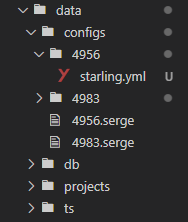

# Transphere Continuous Localization


**Trans-localize**  bridges the gap between development and localization in a seamless
and continuous workflow that aligns with agile development.

Trans-localize uses serge as a continuous localization server and starling as
a CMS and TMS. Together, they form the core part of trans-localize.


### [Learn more at transphere.com &rarr;](https://www.transphere.com/)

# Project Structure



# Starling CLI
Starling command-line tool enables file exchange where they can be downloaded and uploaded to starling CMS via the command-line.

     $ npm install -g @volcengine/starling-cli-public

Before using the Starling Client CLI, you should pre-generate the configuration file and then run the CLI tool . By default, the Starling Client CLI looks for a configuration file named starling.yml in the current directory.

This command uploads files according to starling.yml configurations, which is the configuration file

   ``` $ starling client upload```

This command downloads files according to the configuration file.

```$ starling client download```

        "ak": "Access Key"
        "sk": "Secret Key"
        "basePath": "/project-base-path"
        "projectId": "ProjectId"
    
    "download": {
            "namespaceId": "NamespaceId",
      "taskId": "TaskId"
    }
    "files": [
            {
              "source": "/locale/zh/folder/*.xml",
        "translation": "/locale/%locale%/folder/%original_file_name%"
      }
    ]
Sample Configuration File